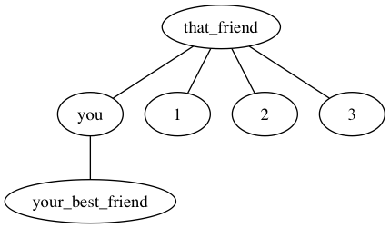

# friendship-paradox
A small python module to play with the friendship paradox:



"most likely your friends have more friends than you do (on average)"

- [Wikipedia Topic](https://en.wikipedia.org/wiki/Friendship_paradox)
- [New York Times](https://opinionator.blogs.nytimes.com/2012/09/17/friends-you-can-count-on/)

# Usage
All the instructions are for unix-like machines (I have a Mac), so you would have to translate if you have a PC.

## Prerequisites
This runs as a simple python module (no external libraries!), so just install the following software above.

- [python](https://www.python.org/)
- <a href="https://en.wikipedia.org/wiki/DOT_(graph_description_language)">dot language (graphviz)</a>

For Mac, I'd recommend installing [brew](https://brew.sh/) and using it to install the software.

## Editing your graph
Edit `friends.dot` to change the structure of the network.

I'd recommend keeping it a very simple dot graph in the style of the first 2 examples, [here](http://graphs.grevian.org/example):
- first line to name graph and open curly brackets
- last line to close curly brackets
- each line in between in `<name> -- <name>;` format (semi-colon is optional)

## Getting results
```
$ # run calculations (assumes friends.dot)
$ python friendship_paradox.py
$ # create png image file from friends.dot
$ dot -T png -O friends.dot
$ # open all png image files
$ open -g *.png
```
Assuming you use the default `friends.dot`, you'll get the image at the top.

For quick experimentation, you can of course combine these into one command with the unix `&&` symbol:
`python friendship_paradox.py && dot -T png -O friends.dot && open -g *.png`
